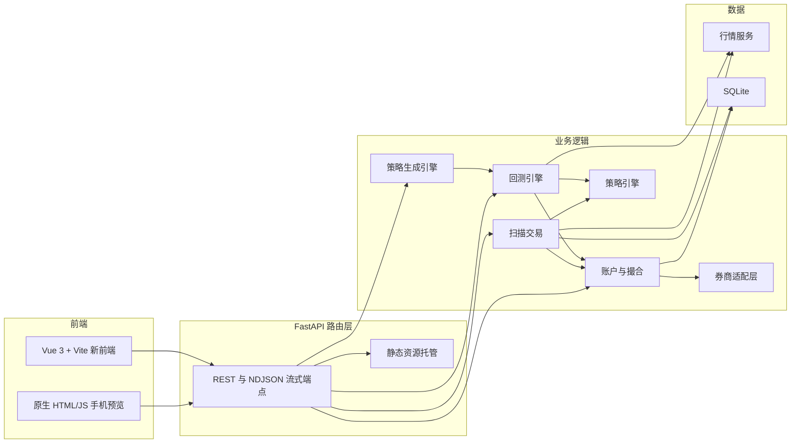
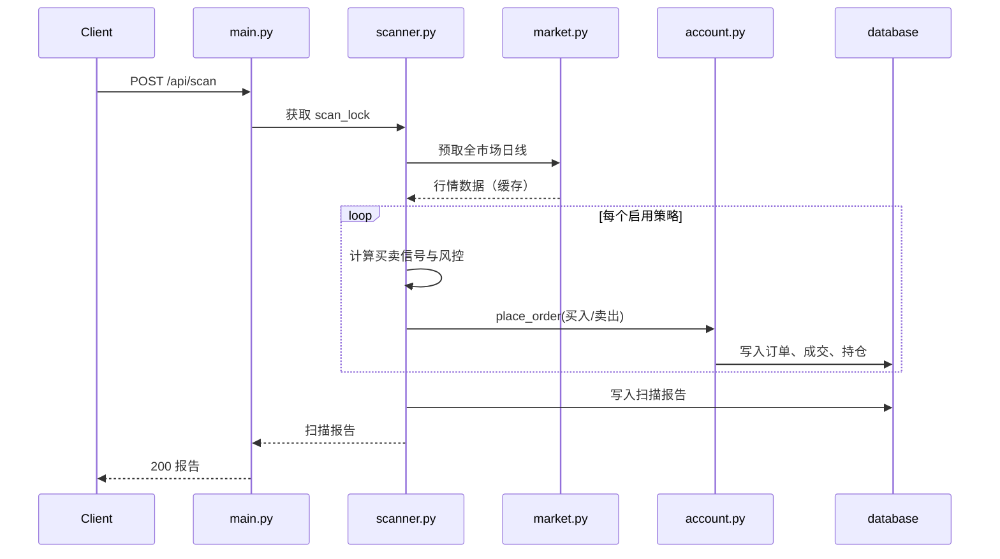

# 系统架构

## 概述

A股自动交易助手是一个面向 A 股交易者的辅助交易系统。用户配置策略后，系统在每个交易日收盘后自动扫描全市场、模拟撮合成交、监控账户与持仓，并提供策略回测与策略生成引擎。

系统当前处于一次架构升级过程中：后端已完成「每策略独立本金」的资金模型改造，并开始引入券商适配层（BrokerAdapter）为未来实盘交易预留接口；前端正从原生 HTML/CSS/JS 手机预览界面重构为 Vue 3 + Vite + TypeScript 单页应用（移动端优先）。

系统数据全部来自公开 HTTP API（腾讯 K 线、新浪股票列表），禁用合成数据；交易为模拟撮合，遵循 A 股 T+1 与涨跌停规则。

## 技术栈

**语言与运行时**
- Python 3.11
- TypeScript（前端重构）

**框架**
- FastAPI（后端 Web 框架）
- Vue 3 + Vite（前端重构）
- SQLAlchemy（ORM）
- APScheduler（定时调度）
- Pinia + Vue Router（前端状态与路由）

**数据存储**
- SQLite（`backend/trading.db`）

**前端**
- 原生 HTML/CSS/JS（`index.html` / `style.css` / `app.js`，旧手机预览界面，仍由后端静态托管）
- Vue 3 + Vite + TypeScript（`frontend/`，重构中的新前端）

**外部服务**
- 腾讯 ifzq K 线接口（日线/周线/月线，前复权）
- 腾讯实时行情接口（股票名称、分时）
- 新浪行情接口（全市场股票列表）
- 用户自备的大模型 OpenAI 兼容接口（可选，用于策略生成的多智能体分析）

## 项目结构

```
workspace/
├── index.html / style.css / app.js   # 旧手机预览界面（原生 JS）
├── frontend/                         # 新前端（Vue 3 + Vite + TypeScript）
│   ├── index.html
│   ├── vite.config.ts                # /api 反向代理到后端 8001
│   └── src/
│       ├── main.ts                   # 应用入口
│       ├── App.vue
│       ├── router/index.ts
│       └── views/HomeView.vue
├── backend/
│   ├── requirements.txt
│   ├── .env.example                  # USER_LLM_* 占位符
│   ├── trading.db                    # SQLite 数据库
│   ├── app/
│   │   ├── main.py                   # FastAPI 入口与 REST 路由
│   │   ├── config.py                 # 全局配置
│   │   ├── database.py               # 数据库连接与迁移
│   │   ├── models.py                 # ORM 模型
│   │   ├── schemas.py                # Pydantic 模型与默认策略
│   │   ├── indicators.py             # 技术指标
│   │   ├── patterns.py               # K 线形态识别
│   │   ├── public_data.py            # 公开数据服务（真实行情）
│   │   ├── market.py                 # 行情服务（缓存与并发预取）
│   │   ├── strategy_engine.py        # 买卖信号判定
│   │   ├── matching.py               # 撮合与费用
│   │   ├── account.py                # 组合逻辑与账户服务
│   │   ├── backtest.py               # 回测引擎
│   │   ├── scanner.py                # 自动扫描交易
│   │   ├── scheduler.py              # 定时调度
│   │   ├── broker.py                 # 券商适配层抽象基类（新增）
│   │   ├── generator.py              # 策略生成引擎
│   │   └── agents.py                 # 多智能体 LLM 分析框架
│   └── tests/                        # 单元测试
└── .monkeycode/
    ├── MEMORY.md
    ├── specs/                        # 历史需求与技术设计文档
    └── docs/                         # 本文档
```

**入口点**
- `backend/app/main.py` - FastAPI 应用入口，启动 uvicorn（默认 8001 端口）
- `frontend/src/main.ts` - 新前端入口
- `backend/app/scheduler.py` - 后台定时任务入口

## 子系统

### FastAPI 路由层
**目的**: 提供 REST 与 NDJSON 流式接口，托管前端静态资源。
**位置**: `backend/app/main.py`
**关键文件**: `main.py`, `schemas.py`
**依赖**: account、backtest、generator、market、scanner、scheduler
**被依赖**: 前端（旧静态页面与新 Vue 前端通过 `/api` 访问）

### 行情数据服务
**目的**: 全系统统一提供真实公开行情数据，带内存 TTL 缓存、磁盘持久化缓存与并发预取。
**位置**: `backend/app/public_data.py`, `market.py`
**关键文件**: `public_data.py`, `market.py`
**依赖**: 腾讯 K 线接口、新浪股票列表接口
**被依赖**: scanner、backtest、generator、main

### 账户与撮合服务
**目的**: 模拟撮合成交、费用计算、风控检查、组合与持仓管理，支持每策略独立本金。
**位置**: `backend/app/account.py`, `matching.py`
**关键文件**: `account.py`, `matching.py`
**依赖**: config、models
**被依赖**: scanner、backtest、main

### 策略引擎与形态识别
**目的**: 根据策略配置判定买卖信号，识别 K 线技术形态，计算技术指标。
**位置**: `backend/app/strategy_engine.py`, `patterns.py`, `indicators.py`
**关键文件**: `strategy_engine.py`, `patterns.py`, `indicators.py`
**依赖**: pandas
**被依赖**: scanner、backtest、generator

### 回测引擎
**目的**: 历史行情重放，输出权益曲线、收益、回撤、胜率等指标。
**位置**: `backend/app/backtest.py`
**关键文件**: `backtest.py`
**依赖**: account、matching、strategy_engine、market
**被依赖**: main、generator

### 扫描与调度
**目的**: 全市场扫描并在信号触发时自动下单，通过全局锁保证单实例运行；定时调度工作日收盘后执行。
**位置**: `backend/app/scanner.py`, `scheduler.py`
**关键文件**: `scanner.py`, `scheduler.py`
**依赖**: account、market、strategy_engine
**被依赖**: main

### 策略生成引擎
**目的**: 启发式生成多个候选策略，用真实行情回测对比，输出推荐策略；可选多智能体 LLM 增强分析。
**位置**: `backend/app/generator.py`, `agents.py`
**关键文件**: `generator.py`, `agents.py`
**依赖**: backtest、market、schemas、agents
**被依赖**: main

### 券商适配层（重构中）
**目的**: 抽象下单与账户操作接口，屏蔽模拟盘与实盘差异，为未来实盘交易预留。
**位置**: `backend/app/broker.py`
**关键文件**: `broker.py`
**依赖**: 无（抽象基类）
**被依赖**: 计划由 scanner、account、main 接入

## 图表

### 系统架构



### 扫描交易时序


