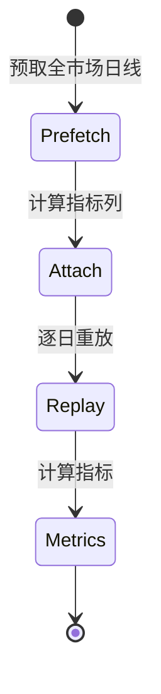

# 回测（Backtest）

回测引擎在历史行情上重放策略，产出权益曲线与统计指标，用于评估策略表现。

## 什么是回测？

回测将策略配置应用于指定区间的历史日线数据，按「信号当日产生、次日开盘价成交」的撮合规则模拟交易，最终输出收益率、回撤、胜率、盈亏比等指标与权益曲线。

**关键特征**:
- 全市场历史重放：覆盖标的池全部股票
- 指标预计算：先对完整历史一次性计算指标列，再逐日切片判定，避免重复 rolling/ewm
- 与扫描一致的撮合规则（次日开盘价、涨跌停、费用）

## 代码位置

| 方面 | 位置 |
|------|------|
| 回测引擎 | `backend/app/backtest.py` |
| 内存组合 | `backend/app/account.py`（Portfolio） |
| 指标计算 | `backend/app/strategy_engine.py`（attach_indicators） |
| API 路由 | `backend/app/main.py`（/api/strategies/{sid}/backtest） |
| 数据库表 | `backtests`、`equity_curve` |

## 结构

```python
def run_backtest(config, market, start, end, initial_capital=1_000_000):
    # 返回 {metrics, equity_curve, trades, signal_stats}

def compute_metrics(equity_curve, portfolio):
    # 返回累计收益、年化收益、最大回撤、胜率、盈亏比、交易笔数
```

### 关键字段（指标）

| 字段 | 类型 | 描述 |
|------|------|------|
| `total_return_pct` | float | 累计收益率（%） |
| `annual_return_pct` | float | 年化收益率（%） |
| `max_drawdown_pct` | float | 最大回撤（%） |
| `win_rate_pct` | float | 胜率（%） |
| `profit_loss_ratio` | float | 盈亏比 |
| `trade_count` | int | 总交易笔数 |
| `closed_trades` | int | 已平仓交易笔数 |

## 不变量

1. **成交一致**: 回测撮合规则与扫描交易一致（次日开盘价、涨跌停拒单、费用一致）
2. **资金守恒**: 权益 = 现金 + 持仓市值，随逐日撮合与更新单调一致
3. **信号窗口**: 信号判定使用固定尾部窗口（128 日），覆盖双底/双顶 60 日回看

## 生命周期


