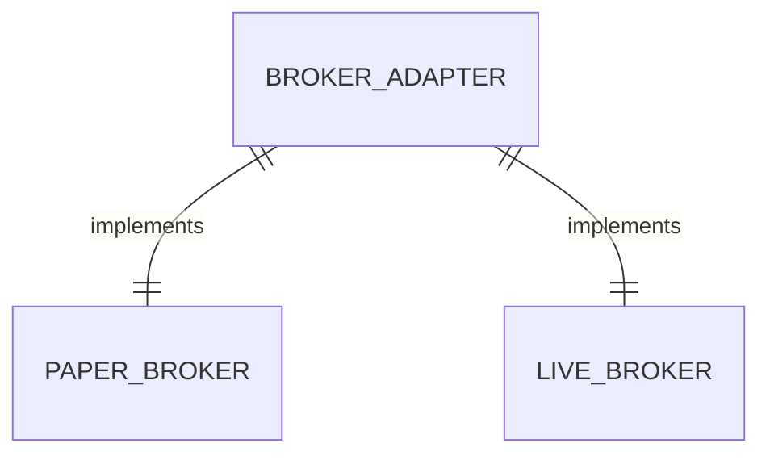

# 券商适配层（BrokerAdapter）

券商适配层是统一的订单与账户操作接口，用于屏蔽模拟盘与实盘差异。

## 什么是 BrokerAdapter？

BrokerAdapter 是券商接口的抽象基类，声明了统一下单、撤单、账户查询、持仓查询、委托查询、成交查询与对账共七个抽象方法。PaperBroker（模拟盘）已实现并复用既有撮合逻辑，LiveBroker（实盘）为占位实现，业务层（扫描交易、账户查询）通过该接口统一下单与查询。

**关键特征**:
- 两种券商类型：`paper`（模拟盘，已实现）、`live`（实盘，预留）
- 业务层与具体券商解耦
- `get_broker()` 工厂函数按类型返回适配器，缺省为模拟盘
- 实盘接入时无需改动扫描/账户业务逻辑

## 代码位置

| 方面 | 位置 |
|------|------|
| 抽象基类与实现 | `backend/app/broker.py` |

## 结构

```python
BROKER_PAPER = "paper"
BROKER_LIVE = "live"

class BrokerAdapter(ABC):
    broker_type = BROKER_PAPER

    @abstractmethod
    def place_order(self, db, code, name, direction, price, qty, reason="", strategy=None): ...
    @abstractmethod
    def cancel_order(self, db, order_id): ...
    @abstractmethod
    def get_account(self, db): ...
    @abstractmethod
    def get_positions(self, db): ...
    @abstractmethod
    def get_orders(self, db): ...
    @abstractmethod
    def get_trades(self, db): ...
    @abstractmethod
    def reconcile(self, db): ...

class PaperBroker(BrokerAdapter):
    broker_type = "paper"
    # place_order 复用 AccountService.place_order 完成模拟撮合
    # reconcile 校验各策略资金守恒（现金 + 持仓成本 = 本金 + 已实现盈亏）

class LiveBroker(BrokerAdapter):
    broker_type = "live"
    # 各方法抛出「实盘券商未接入」错误
```

### 关键字段

| 字段 | 类型 | 描述 | 约束 |
|------|------|------|------|
| `broker_type` | str | 券商类型 | `paper` 或 `live` |

## 不变量

1. **接口统一**: 业务层只依赖 BrokerAdapter 抽象接口，不依赖具体券商实现
2. **实盘隔离**: LiveBroker 各方法在未接入真实券商前返回「实盘券商未接入」错误

## 关系



| 关联概念 | 关系 | 描述 |
|---------|------|------|
| PaperBroker | 实现 | 复用 AccountService 完成模拟撮合 |
| LiveBroker | 实现 | 实盘券商占位，接入真实券商后落地 |
