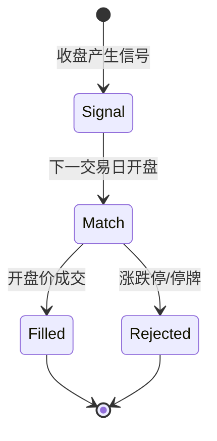

# 撮合与费用（Matching）

撮合引擎负责模拟成交与 A 股费用计算，是回测与扫描交易的成交基础。

## 什么是撮合？

系统采用「次日开盘价成交」模型：当日收盘后产生的信号，在下一交易日开盘价撮合成交，符合 A 股 T+1 制度。撮合过程处理涨跌停与停牌无法成交的情形。

**关键特征**:
- 次日开盘价成交（回测与扫描一致）
- 涨跌停拒单：买入遇涨停、卖出遇跌停无法成交
- 停牌拒单：开盘无成交则拒单
- 按 A 股规则计费：佣金、印花税（仅卖出）、过户费

## 代码位置

| 方面 | 位置 |
|------|------|
| 撮合与费用 | `backend/app/matching.py` |
| 费用参数 | `backend/app/config.py` |

## 结构

```python
def calc_fees(direction, price, qty):
    # 返回 (commission, tax, transfer_fee)
    commission = max(amount * 0.00025, 5.0)  # 佣金万 2.5，最低 5 元
    tax = amount * 0.0005 if direction == "sell" else 0.0  # 印花税仅卖出
    transfer_fee = amount * 0.00001  # 过户费

def match_fill(direction, prev_close, next_bar):
    # 返回 (fill_price, reject_reason)
    # 开盘价成交；涨停/跌停/停牌返回拒单原因

def round_lot(qty):
    # 向下取整到 100 股整数倍
```

### 关键字段

| 字段 | 类型 | 描述 | 约束 |
|------|------|------|------|
| `commission` | float | 佣金 | 万 2.5，最低 5 元 |
| `tax` | float | 印花税 | 仅卖出收取，万 5 |
| `transfer_fee` | float | 过户费 | 万 0.1 |

## 不变量

1. **最小手数**: 买卖数量必须为 100 股整数倍，不足 100 股不成交
2. **涨停拒买**: 买入时开盘涨幅达到涨停（约 9.8% 容差）则拒单
3. **跌停拒卖**: 卖出时开盘跌幅达到跌停则拒单
4. **停牌拒单**: 开盘无成交量（停牌）则拒单
5. **成本含费**: 持仓摊薄成本含买入佣金与过户费

## 生命周期


