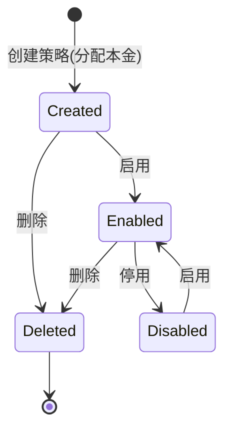
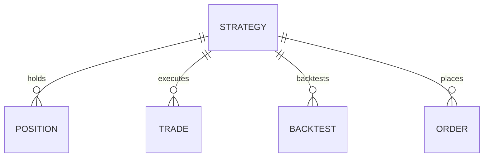

# 策略（Strategy）

策略是系统的核心概念，代表一套可独立启停、独立调参、独立持有资金的交易规则。

## 什么是策略？

策略定义了一组买入信号、一组卖出信号与一组风控参数。每个策略拥有独立的分配本金与可用现金，独立运作、独立计算盈亏，账户总资产按全部策略聚合。

**关键特征**:
- 独立本金：每个策略默认分配 100 万，可创建/编辑时调配
- 独立现金与持仓：下单按策略自身资金与持仓运作
- 信号可组合：买入/卖出信号均可独立启停并配置参数
- 全市场扫描：启用状态下参与每日收盘后扫描

## 代码位置

| 方面 | 位置 |
|------|------|
| ORM 模型 | `backend/app/models.py`（Strategy） |
| Pydantic 模型 | `backend/app/schemas.py`（StrategyCreate / StrategyUpdate） |
| 默认配置 | `backend/app/schemas.py`（default_config） |
| 信号判定 | `backend/app/strategy_engine.py` |
| 资金分配 | `backend/app/account.py`（ensure_strategy_capital） |
| API 路由 | `backend/app/main.py`（/api/strategies） |
| 数据库表 | `strategies` |

## 结构

```python
class Strategy(Base):
    id: int            # 唯一标识
    name: str          # 名称
    enabled: int       # 0/1 是否启用
    config_json: str   # 策略配置 JSON
    initial_capital: float  # 分配本金
    available_cash: float   # 可用现金
```

策略配置 JSON 结构：

```json
{
  "buy": {
    "maCross": {"enabled": false, "shortPeriod": 5, "longPeriod": 20},
    "breakHigh": {"enabled": true, "days": 20},
    "hammer": {"enabled": false}
  },
  "sell": {
    "takeProfit": {"enabled": true, "percent": 10},
    "stopLoss": {"enabled": true, "percent": 5}
  },
  "risk": {
    "maxPositionPercent": 20,
    "maxHoldings": 10,
    "maxSingleLoss": 15,
    "totalStopLoss": 20,
    "maxDrawdown": 25
  }
}
```

### 关键字段

| 字段 | 类型 | 描述 | 约束 |
|------|------|------|------|
| `initial_capital` | float | 分配本金 | ≥ 0，缺省 100 万 |
| `available_cash` | float | 可用现金 | 随交易增减 |
| `enabled` | int | 是否启用 | 0 或 1 |

### 买入信号（9 个）

均线金叉、MACD 金叉、突破 N 日最高价、放量突破、锤子线、看涨吞没、早晨之星、红三兵、双底、RSI 超卖、KDJ 金叉、布林下轨反弹。

### 卖出信号（12 个）

固定止盈、固定止损、移动止盈、均线死叉、MACD 死叉、跌破均线、持有天数到期、上吊线、看跌吞没、黄昏之星、三只乌鸦、双顶、RSI 超买、KDJ 死叉、布林下穿中轨。

## 不变量

1. **本金守恒**: 编辑策略调整 `initial_capital` 时，不能低于当前持仓成本（`available_cash = initial_capital - invested ≥ 0`）
2. **独立运作**: 策略下单只消耗自身 `available_cash`，不与其他策略或账户级现金混用
3. **持仓归属**: 每笔持仓通过 `strategy_id` 归属到具体策略

## 生命周期



## 关系



| 关联概念 | 关系 | 描述 |
|---------|------|------|
| 持仓（Position） | 持有 | 每个策略通过 `strategy_id` 拥有若干持仓 |
| 成交（Trade） | 执行 | 每个策略产生多笔成交 |
| 回测（Backtest） | 回测 | 每个策略可运行多次回测 |
