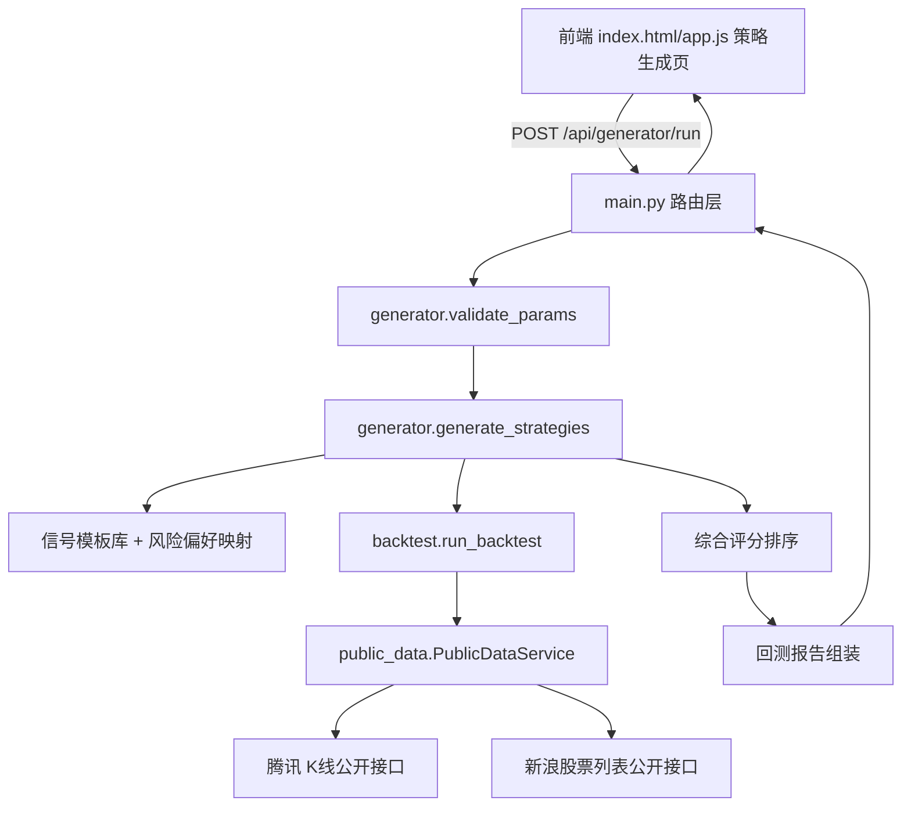

# 策略生成引擎（Strategy Generation Engine）

Feature Name: 2026-08-14-strategy-generation-engine
Updated: 2026-08-14

## Description

在现有 A股自动交易助手基础上新增策略生成引擎。用户输入标的范围、回测区间、风险偏好、生成数量与收益目标后，系统通过启发式规则从买卖信号模板库中采样生成多个候选策略，全部候选使用公开数据 API 获取的真实前复权日线行情执行回测，输出综合评分排序、指标对比表与叠加权益曲线。系统禁用合成数据，数据源不可用时直接报错。

数据源方案（已验证可用）：
- 日线行情：腾讯 `web.ifzq.gtimg.cn/appstock/app/fqkline/get`，参数 `code,day,start,end,count,qfq`
- 全市场股票列表：新浪 `vip.stock.finance.sina.com.cn/quotes_service/api/json_v2.php/Market_Center.getHQNodeData?node=hs_a`

## Architecture



## Components and Interfaces

### 1. `public_data.py` — 公开数据服务（新增）

负责从公开 API 获取真实行情，禁止合成数据降级。

- `class DataUnavailableError(Exception)`: 数据源不可用时抛出的异常
- `class PublicDataService`:
  - `get_stock_list() -> list[(code, name)]`：调用新浪 `getHQNodeData(node=hs_a)` 获取全市场 A 股列表，过滤创业板（`300`/`301` 开头）、科创板（`688`/`689` 开头）与北交所（`8`/`4`/`9` 开头及 `bj` 前缀），仅保留沪深主板
  - `get_daily_bars(code, start, end) -> pd.DataFrame`：调用腾讯 `fqkline/get` 接口，`qfq` 前复权，返回列 `date/open/high/low/close/volume` 按日期升序；失败或空数据抛 `DataUnavailableError`
  - `_fetch_json(url, timeout)`：统一带超时与异常包装的 HTTP 请求辅助

错误处理：请求异常、HTTP 非 2xx、响应体为空、解析失败，统一抛 `DataUnavailableError`，不返回合成数据。

### 2. `generator.py` — 策略生成与报告（新增）

- `RISK_PROFILES: dict`：风险偏好 → 风控参数集

| 参数 | conservative | balanced | aggressive |
|------|--------------|----------|------------|
| maxPositionPercent | 10 | 20 | 30 |
| maxHoldings | 5 | 8 | 12 |
| maxSingleLoss | 8 | 12 | 18 |
| totalStopLoss | 15 | 20 | 25 |
| maxDrawdown | 15 | 20 | 25 |

- `SIGNAL_TEMPLATES: list[dict]`：买卖信号组合模板库，每个模板包含买入信号与卖出信号的启用组合及默认参数，覆盖趋势（均线/突破）、动量（MACD）、形态（锤子线/吞没/晨星等）与风控卖出（止盈止损/移动止盈/均线死叉/持有天数）等组合方式
- `validate_params(payload) -> None`：按 Requirement 1 的 AC2-AC6 校验，非法时抛 `ValueError`（由路由层转 400）
- `generate_strategies(payload) -> list[dict]`：
  1. 由 `risk_profile` 取基础风控参数集
  2. 从模板库采样 `count` 个模板，对每个模板在参数合理范围内做扰动（如均线周期、止盈止损百分比、突破天数），生成 `count` 个候选策略配置
  3. 保证任意两个候选存在信号或参数差异（AC5），且至少含一个买入信号与一个卖出信号（AC6）
  4. 返回候选策略配置列表
- `score_strategy(metrics, target_annual_return) -> float`：综合评分
  - `score = 年化收益率 + 0.4 × 目标年化接近度 − 0.5 × 最大回撤 + 0.2 × 胜率 + 0.1 × 盈亏比`
  - 接近度 = `max(0, 1 − |年化 − target| / max(target, 1))`
- `build_report(payload, results) -> dict`：组装 Requirement 5 要求的报告结构

### 3. `main.py` — 路由层（修改）

新增端点：

- `POST /api/generator/run`
  - Request body（Pydantic `GeneratorRequest`）：
    ```json
    {
      "targets": {"scope": "single" | "custom" | "market", "codes": ["600519"]},
      "start_date": "2024-01-01",
      "end_date": "2025-01-01",
      "risk_profile": "balanced",
      "count": 5,
      "target_annual_return": 15.0
    }
    ```
  - 处理流程：`validate_params` → 解析标的（`market` 时调用 `get_stock_list`，`single`/`custom` 用给定代码）→ `generate_strategies` → 对每个候选调用 `backtest.run_backtest(cfg, public_data, start, end)` → 计算评分排序 → `build_report`
  - Response：报告 JSON（输入参数、候选策略配置、指标、排名、推荐策略、权益曲线）
  - 异常映射：`DataUnavailableError` → HTTP 502 数据源错误；`ValueError` → HTTP 400 参数错误

现有 `MarketDataService`（akshare + 合成降级）保留给扫描与账户功能使用，策略生成引擎独立使用 `PublicDataService`，互不影响。

### 4. `schemas.py` — 请求模型（修改）

新增 `GeneratorRequest` Pydantic 模型，字段按 Requirement 1 定义，`count` 带 1..10 校验，`risk_profile` 带枚举校验。

### 5. 前端 `index.html` / `app.js`（修改）

- 新增「策略生成」入口与表单：标的范围（单选/自定义输入/全市场）、回测起止日期、风险偏好选择、生成数量、目标年化
- 提交后调用 `POST /api/generator/run`，渲染：
  - 对比表格：策略序号、信号组合摘要、年化收益率、累计收益率、最大回撤、胜率、盈亏比、交易次数、排名
  - 叠加权益曲线图：基于 Canvas 将各候选策略逐日权益序列绘制在同一坐标系
  - 推荐策略卡片
- 失败时展示错误信息，保留已填参数

## Data Models

### 生成请求（GeneratorRequest）

| 字段 | 类型 | 约束 | 说明 |
|------|------|------|------|
| targets.scope | enum | single/custom/market | 标的范围类型 |
| targets.codes | list[str] | custom 必填，其余忽略 | 股票代码列表 |
| start_date | str | YYYY-MM-DD | 回测开始 |
| end_date | str | YYYY-MM-DD，晚于 start_date | 回测结束 |
| risk_profile | enum | conservative/balanced/aggressive | 风险偏好 |
| count | int | 1..10 | 生成数量 |
| target_annual_return | float | ≥ 0 | 目标年化（%） |

### 生成报告（Response）

```json
{
  "request": { "targets": ..., "start_date": ..., "end_date": ..., "risk_profile": ..., "count": ..., "target_annual_return": ... },
  "strategies": [
    {
      "index": 0,
      "config": { "buy": {...}, "sell": {...}, "risk": {...} },
      "metrics": { "total_return_pct": ..., "annual_return_pct": ..., "max_drawdown_pct": ..., "win_rate_pct": ..., "profit_loss_ratio": ..., "trade_count": ... },
      "equity_curve": [{"date": "...", "equity": ...}]
    }
  ],
  "ranking": [{"index": 0, "score": 12.34}],
  "recommended_index": 0
}
```

## Correctness Properties

1. 全部候选策略在相同的 `start_date`/`end_date` 与同一股票池上回测，保证对比可比性
2. 每个候选策略配置结构符合现有 `strategy_engine` 与 `backtest` 的消费格式（`buy`/`sell`/`risk` 三级结构）
3. 候选策略两两在信号组合或参数取值上存在差异，`count=1` 时允许仅一个策略
4. 数据层只返回公开 API 真实数据；任何失败路径抛 `DataUnavailableError`，禁止返回合成行情
5. 股票池过滤后仅保留沪深主板（排除 300/301/688/689/北交所），与现有全市场扫描规则一致

## Error Handling

| 场景 | 行为 |
|------|------|
| 参数不合法（数量/日期/偏好/标的） | HTTP 400，返回具体字段错误 |
| 腾讯/新浪接口不可达、超时、返回空 | HTTP 502，返回「行情数据源不可用」 |
| 单只股票无历史数据 | 该股票从回测池中跳过；全部无数据时返回 HTTP 502 |
| 目标年化非法（负数/非数值） | HTTP 400 |

## Test Strategy

新增 `backend/tests/test_generator.py` 与 `backend/tests/test_public_data.py`：

1. `validate_params`：覆盖 AC2-AC6 各非法输入分支，断言抛出 `ValueError`
2. `generate_strategies`：断言生成数量等于 `count`、配置结构合法、信号组合两两差异、每个策略含启用买入与卖出信号
3. 风险偏好映射：三种偏好下 `risk` 参数取值符合映射表
4. 评分函数：更高年化、更低回撤、更高胜率的策略评分更高；目标年化接近的策略评分更高
5. `public_data`：使用录制的真实 API 响应样本，断言字段解析正确；mock 请求失败时断言抛 `DataUnavailableError` 而非返回数据
6. 全流程集成测试：mock `PublicDataService` 返回固定行情，断言 `/api/generator/run` 返回报告结构完整、排名正确

## References

[^1]: (Website) - [腾讯股票 K 线接口文档](https://stockapp.finance.qq.com/mstats/#)
[^2]: (Website) - [新浪股票行情接口说明](https://finance.sina.com.cn/)
