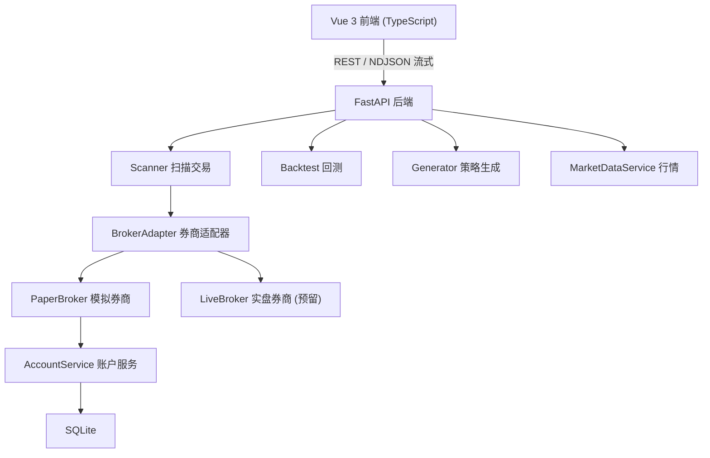

# 交易终端重构与实盘升级

Feature Name: trading-terminal-rebuild
Updated: 2026-08-16

## Description

将 A 股自动交易助手的前端从原生 HTML/CSS/JS 手机预览重构为 Vue 3 + Vite + TypeScript 的移动优先交易终端，并在后端引入券商接口抽象层（BrokerAdapter）：模拟券商（PaperBroker）复用既有撮合逻辑先行落地，实盘券商（LiveBroker）预留接口，未来按需接入。下单链路、策略引擎、扫描交易与回测逻辑保持不变。

## Architecture



前端与后端通过 REST API 与 NDJSON 流式接口通信，Vite 开发服务器将 `/api` 反向代理至后端。后端新增券商适配器层，扫描交易通过适配器统一下单，模拟盘复用既有 `AccountService`，实盘实现预留。

## Components and Interfaces

### 后端：券商适配器层

新增 `backend/app/broker.py`，定义抽象基类与两个实现：

```python
class BrokerAdapter(ABC):
    broker_type: str  # "paper" / "live"

    @abstractmethod
    def place_order(self, db, code, name, direction, price, qty, reason="", strategy=None) -> Order: ...
    @abstractmethod
    def cancel_order(self, db, order_id: int) -> Order: ...
    @abstractmethod
    def get_account(self, db) -> dict: ...
    @abstractmethod
    def get_positions(self, db) -> list: ...
    @abstractmethod
    def get_orders(self, db) -> list: ...
    @abstractmethod
    def get_trades(self, db) -> list: ...
    @abstractmethod
    def reconcile(self, db) -> dict: ...
```

- **PaperBroker**：实现 `BrokerAdapter`，内部调用既有 `AccountService.place_order` 完成模拟撮合；`broker_type="paper"`。
- **LiveBroker**：实现 `BrokerAdapter`，本期各方法返回「实盘券商未接入」错误；`broker_type="live"`，作为未来券商实现的占位与接口契约。

`scanner.py` 中 `scan_and_trade` 的 `accounts.place_order` 调用改为通过 `BrokerAdapter` 实例下单，模拟盘默认使用 `PaperBroker`。

### 后端：现有模块保留

- `main.py` 路由保持既有 REST 契约，`/api/account` 增加 `broker_type` 字段标识当前券商模式。
- `account.py`、`scanner.py`、`strategy_engine.py`、`backtest.py`、`generator.py` 逻辑不变，仅下单入口改走适配器。
- `models.py` 的 `Order` 增加 `external_order_id`（外部委托号，实盘预留）与 `broker_type` 字段。

### 前端：Vue 3 应用结构

新建 `frontend/` 目录，工程结构：

```
frontend/
├── vite.config.ts        # /api 反向代理 → 后端 8001
├── src/
│   ├── main.ts
│   ├── App.vue
│   ├── router/index.ts   # 页面路由
│   ├── stores/           # Pinia 状态：account / strategy / position / trade
│   ├── api/             # REST 封装 + NDJSON 流式解析
│   ├── views/           # Home / Strategy / Backtest / Trade / Generator
│   └── components/      # AssetCard / PositionList / StrategyTabs / StrategyEditor / EquityChart / ScanMask
```

- 状态管理使用 Pinia，账户、持仓、策略、交易各一个 store，避免重复请求。
- 扫描进度与生成引擎进度沿用 NDJSON 流式接口，在 `api/` 中统一封装。
- 界面移动优先：底部导航 + 单列布局，触摸交互（滑动返回、下拉刷新）。

## Data Models

沿用 `models.py` 的 `Strategy`、`Account`、`Position`、`Order`、`Trade`、`ScanReport`、`Backtest`、`EquityPoint`，并做以下扩展：

| 模型 | 新增字段 | 类型 | 说明 |
|------|---------|------|------|
| Order | `broker_type` | String(10) | 下单券商类型：paper / live |
| Order | `external_order_id` | String(64) | 外部券商委托号，实盘回填 |

策略资金模型沿用「每个策略独立本金」，`Strategy.initial_capital` 为各策略分配本金。

## Correctness Properties

- **资金守恒**：模拟盘任意时刻，各策略 `available_cash` 与持仓成本之和扣除已实现盈亏与费用后等于初始本金；`/api/account` 总资产等于各策略权益之和。
- **下单原子性**：`BrokerAdapter.place_order` 对每笔订单要么成交并更新资金与持仓，要么拒绝并记录原因，不产生半途状态。
- **并发互斥**：所有扫描入口（手动、流式、定时）通过 `scanner.scan_lock` 串行化，同一时刻仅一个扫描在运行。
- **实盘二次确认**：实盘模式下每笔真实订单下发前必须经用户确认，确认链路与下单链路解耦。

## Error Handling

- 券商适配器下单失败：返回错误状态并在订单表记录拒绝原因，前端 toast 提示。
- 实盘券商未接入：`LiveBroker` 各方法返回明确错误，前端标注「实盘未接入」。
- 实盘订单未知状态：标记订单为异常，提示用户核对，记录原始错误信息。
- 行情数据源失败：沿用现有 `DataUnavailableError` 机制，扫描跳过该股票并继续。

## Test Strategy

- 后端单测：`PaperBroker` 下单/撤单/对账、资金守恒、并发锁互斥、`/api/account` 聚合口径。
- 前端单测：Vitest 覆盖关键组件与 Pinia store 状态流转；API 层使用 mock 校验流式解析。
- 集成验证：扫描交易全链路（策略信号 → 适配器 → 模拟撮合 → 账户/持仓刷新）。
- 既有 117 项后端测试保持通过。

## References

[^1]: (README.md) - 项目概览与技术栈
[^2]: (backend/app/scanner.py) - 扫描交易与下单入口
[^3]: (backend/app/account.py) - 账户服务与模拟撮合
[^4]: (.monkeycode/specs/a-share-auto-trading/design.md) - 基础架构设计
[^5]: (.monkeycode/specs/2026-08-14-strategy-generation-engine/design.md) - 策略生成引擎设计
