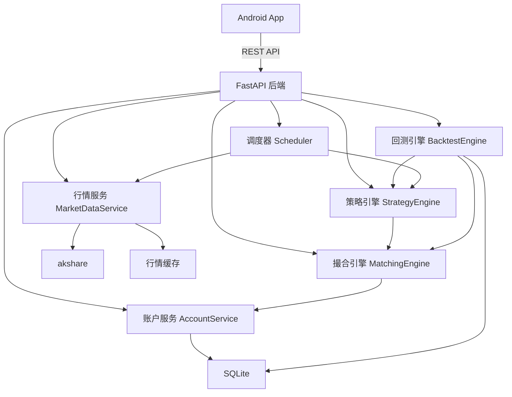

# A股自动交易助手 - 技术设计

Feature Name: a-share-auto-trading
Updated: 2026-08-14

## Description

面向 A 股交易者的辅助交易系统，由原生 Android App（前端）与 Python 后端组成。后端持续运行策略引擎，扫描沪深主板全市场，基于真实行情在本地模拟撮合成交，并提供策略回测能力。本期为模拟交易，不接入真实券商。

技术选型：

- 后端：Python 3.11 + FastAPI + akshare + pandas + APScheduler + SQLite（SQLAlchemy）
- 前端：原生 Android（Kotlin + Jetpack Compose）；交互先用 Web 原型验证（`/workspace/index.html`）
- 通信：REST API（JSON）

## Architecture



数据流说明：

1. 调度器在交易日收盘后触发全市场扫描。
2. 行情服务从 akshare 拉取标的池股票日线并缓存。
3. 策略引擎对每只股票计算买入信号，产出候选买入列表。
4. 撮合引擎按下一交易日开盘价模拟成交，账户服务执行资金/持仓变更与风控检查。
5. 回测引擎复用策略引擎与撮合引擎，对历史区间重放行情生成报告。

## Components and Interfaces

### 1. 行情服务 MarketDataService

| 方法 | 说明 |
|------|------|
| `get_stock_list()` | 返回沪深主板股票列表，排除创业板（300/301）与科创板（688/689） |
| `get_daily_bars(code, start, end)` | 返回某股票日线行情（open/high/low/close/volume） |
| `is_trading_day(date)` | 判断是否交易日 |

职责：封装 akshare 调用；本地缓存日线数据；对超时/字段变动做重试与降级。

### 2. 指标计算 Indicators

| 方法 | 说明 |
|------|------|
| `ma(close, period)` | 移动平均线 |
| `macd(close, fast, slow, signal)` | 返回 DIF、DEA |
| `highest(close, n)` | 近 N 日最高价 |
| `volume_ma(volume, n)` | 成交量均线 |

职责：纯函数实现，供策略引擎与回测引擎复用。

### 3. 策略引擎 StrategyEngine

| 方法 | 说明 |
|------|------|
| `evaluate_buy(strategy, bars)` | 判断是否满足全部启用买入信号 |
| `evaluate_sell(strategy, position, bars)` | 判断是否触发任一启用卖出信号，返回卖出原因 |

买入信号（全部满足）：均线金叉、MACD 金叉、突破 N 日最高价、放量突破，以及 K 线形态（锤子线、看涨吞没、早晨之星、红三兵、双底）。
卖出信号（任一满足）：固定止盈、固定止损、移动止盈、均线死叉、MACD 死叉、跌破均线、持有天数到期，以及 K 线形态（上吊线、看跌吞没、黄昏之星、三只乌鸦、双顶）。

K 线形态识别由 `patterns.py` 模块实现，每个形态一个纯函数（`is_hammer`、`is_bullish_engulfing` 等），通过 `detect(bars, name)` 统一调度，基于经典技术分析规则：实体/上下影线比例、吞没关系、连续 K 线组合、双底双顶颈线突破等。

### 4. 撮合引擎 MatchingEngine

| 方法 | 说明 |
|------|------|
| `match(order, next_bar)` | 按下一交易日开盘价撮合，返回成交或拒单 |

规则：成交价取次日开盘价；处理涨跌停（无法成交则拒单）、停牌（拒单）；按 A 股收取佣金（万 2.5，最低 5 元）、印花税（卖出 0.05%）、过户费；买入以 100 股为最小单位；遵循 T+1 制度（买入当日不可卖出，由 `evaluate_sell` 以 `hold_days < 1` 强制拦截）。

### 5. 账户服务 AccountService

| 方法 | 说明 |
|------|------|
| `place_order(...)` | 下单并执行风控检查 |
| `get_positions()` | 当前持仓 |
| `get_account()` | 资金与总资产 |
| `check_risk(...)` | 风控阈值检查（单只仓位、持仓数、止损线、回撤） |
| `roll_daily(...)` | 新交易日开始时持仓持有天数 +1（支撑 T+1 与持有天数信号） |

职责：维护资金、持仓、订单、成交记录；触发风控时停止开新仓。单只最大亏损 `maxSingleLoss` 在 `evaluate_sell` 中作为强制风控（配置 > 0 即生效，优先于卖出信号）。

### 6. 回测引擎 BacktestEngine

| 方法 | 说明 |
|------|------|
| `run_backtest(strategy_id, start, end)` | 重放历史行情，产出收益曲线与统计指标 |
| `compute_metrics(equity_curve, trades)` | 计算收益率、年化、回撤、胜率、盈亏比 |

### 7. 调度器 Scheduler

- 交易日 15:05 触发全市场扫描（APScheduler cron）。
- 盘中按需刷新持仓盈亏。

### 8. REST API（App 消费）

| 方法 | 路径 | 说明 |
|------|------|------|
| GET | `/api/account` | 账户总览 |
| GET | `/api/positions` | 持仓列表 |
| GET | `/api/trades` | 交易记录 |
| GET/POST/PUT/DELETE | `/api/strategies` | 策略增删改查 |
| POST | `/api/strategies/{id}/backtest` | 发起回测 |
| GET | `/api/strategies/{id}/backtests/{bid}` | 回测结果 |
| GET | `/api/logs` | 运行日志与告警 |

## Data Models

### 表结构（SQLite）

- `strategies(id, name, enabled, config_json, created_at, updated_at)`：config_json 存储买入/卖出信号与风控参数。
- `accounts(id, initial_capital, available_cash, created_at)`。
- `positions(id, account_id, code, name, qty, avg_cost, updated_at)`。
- `orders(id, account_id, code, direction, qty, price, status, reason, created_at)`：status 为 pending/filled/rejected。
- `trades(id, order_id, code, direction, qty, price, commission, tax, transfer_fee, pnl, traded_at)`。
- `daily_bars(code, date, open, high, low, close, volume)`：行情缓存，唯一键 (code, date)。
- `backtests(id, strategy_id, start_date, end_date, metrics_json, created_at)`。
- `equity_curve(backtest_id, date, equity)`。

### 策略配置 JSON（config_json）

```json
{
  "buy": {
    "maCross": { "enabled": true, "shortPeriod": 5, "longPeriod": 20 },
    "macdCross": { "enabled": false, "fast": 12, "slow": 26, "signal": 9 },
    "breakHigh": { "enabled": false, "days": 20 },
    "volumeBreak": { "enabled": false, "multiple": 1.5, "avgDays": 5 }
  },
  "sell": {
    "takeProfit": { "enabled": true, "percent": 10 },
    "stopLoss": { "enabled": true, "percent": 5 },
    "trailingStop": { "enabled": false, "drawdown": 8 },
    "maDeathCross": { "enabled": false, "shortPeriod": 5, "longPeriod": 20 },
    "macdDeathCross": { "enabled": false },
    "belowMA": { "enabled": false, "period": 20 },
    "maxHoldDays": { "enabled": false, "days": 20 }
  },
  "risk": {
    "maxPositionPercent": 20,
    "maxHoldings": 10,
    "maxSingleLoss": 15,
    "totalStopLoss": 20,
    "maxDrawdown": 25
  }
}
```

## Correctness Properties

- 账户不变量：可用资金 + 持仓市值 = 总资产，任何成交后保持一致。
- 持仓数量恒非负；卖出数量不超过持仓数量。
- 买入金额 + 费用不超过可用资金。
- 标的池恒排除创业板与科创板股票。
- T+1：当日买入的股票当日不可卖出。
- 回测与模拟交易使用同一套撮合与风控逻辑，保证结果一致。

## Error Handling

- akshare 超时/字段变动：重试 3 次，失败则中止本轮扫描并记录告警，保留现有持仓。
- 涨跌停/停牌无法成交：订单标记 rejected，保留持仓与资金，记录拒绝原因。
- 数据库写入失败：事务回滚并记录告警。
- 非法策略参数：保存前校验，拒绝负值、超范围值并提示。
- 回测区间无数据：返回明确错误，不产出空报告。

## Test Strategy

- 单元测试：Indicators 各指标用已知序列断言（如 MA、MACD 交叉点）。
- 撮合引擎测试：涨跌停拒单、停牌拒单、费用计算、整手取整。
- 风控测试：单只仓位超限、持仓数超限、止损线触发时停止开仓。
- 回测测试：给定固定行情序列，断言收益曲线与统计指标与手工计算一致。
- API 集成测试：策略 CRUD、回测发起与结果查询、账户与持仓接口。

## References

[^1]: (akshare) - [AKShare 开源财经数据接口](https://akshare.akfamily.xyz/)
[^2]: (FastAPI) - [FastAPI 官方文档](https://fastapi.tiangolo.com/)
